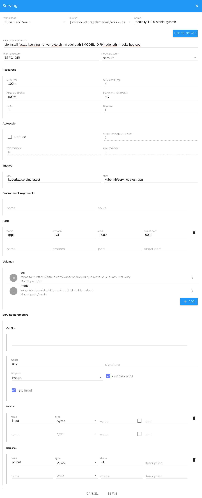

# Start deoldify serving on Kibernetika.AI

## Ensure model exists

The serving requires PyTorch model. To make it available, need to upload it to
the Kibernetika.AI using `kdataset` CLI tool. 

The archive containing `.pth` file can be downloaded using this URL: 

```bash
https://dev.kibernetika.io/api/v0.2/workspace/kuberlab-demo/mlmodel/deoldify/versions/1.0.0-stable-pytorch/download/model-deoldify-1.0.0-stable-pytorch.tar
```

After downloading and unpacking the `.tar` file, you are ready for uploading.
In directory containing the `.pth` file:

```bash
kdataset --type model push <workspace> deoldify:1.0.0-stable-pytorch
```

## Starting and configuring serving

* Open Kibernetika.AI web UI, change to appropriate workspace
* Click to the Catalog -> Models, find just uploaded model
* Click to Versions tab, click "Serve"
* Configure serving such as the following:

**Note**: Pick up the appropriate workspace, cluster and name.

If you don't have an available GPU, then change **GPU** parameter in **Resources** section to 0.


